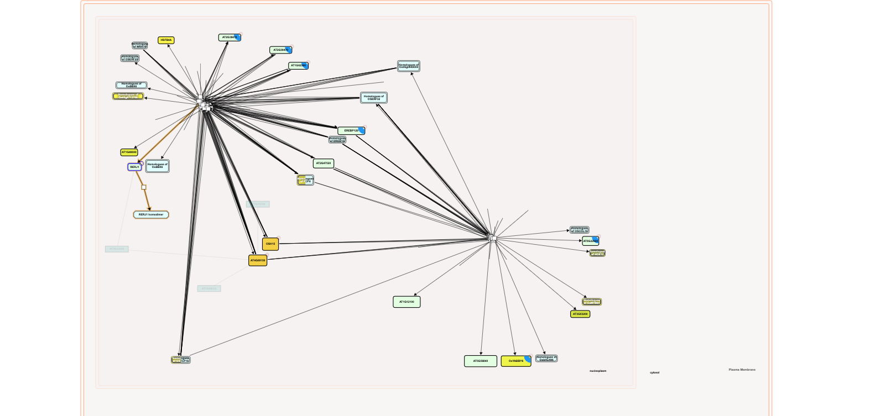
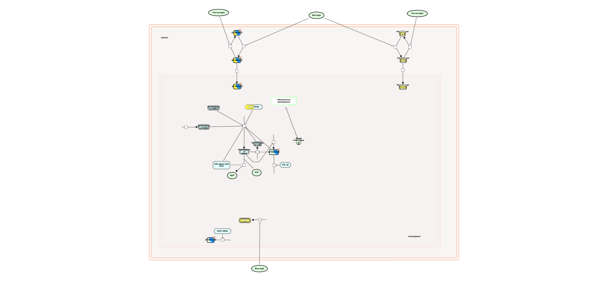
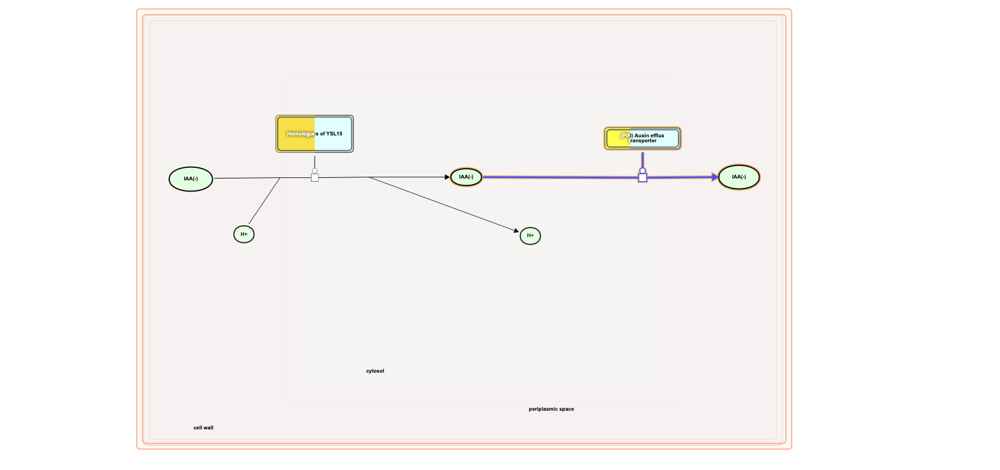
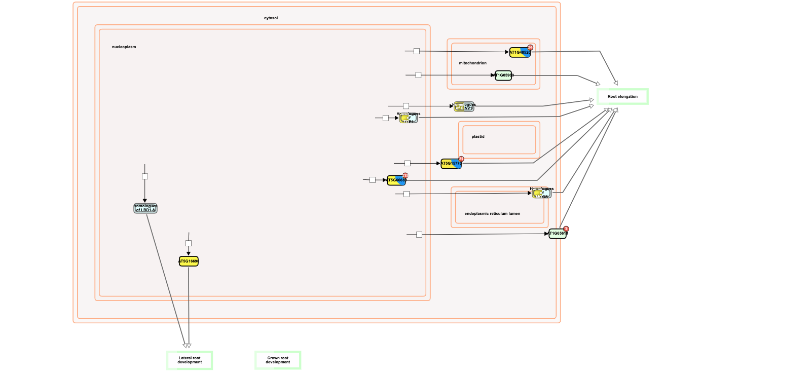
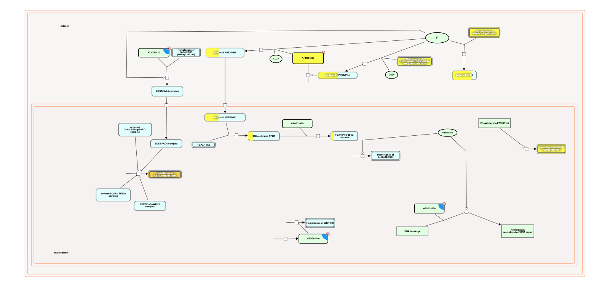
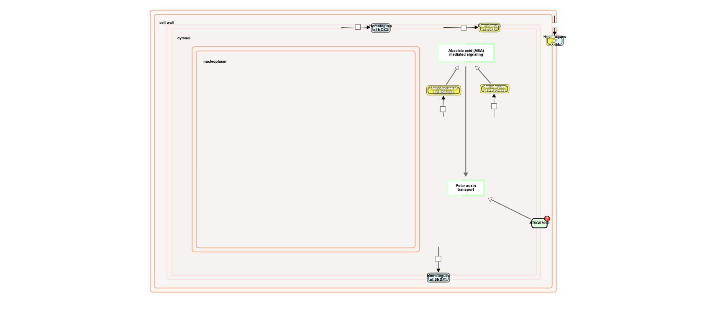
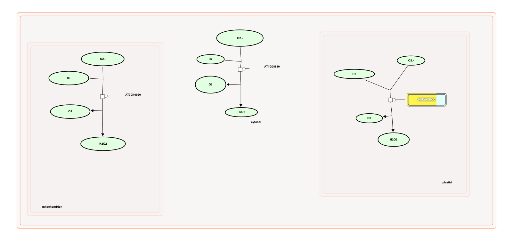

# Reactome analysis of Pseudo-time-series expression matrix FL vs GC

Log2 foldchange data from  "FL\_vs\_GC\_OSD-37OSD-38OSD-120OSD-217OSD-321\_DGE.csv" was analysed using Plant Reactome (Data in tabel in AWG repo).

Reactome created a detailed list of pathways, reactions, and entities involved in various biological processes, specifically from the plant species _Arabidopsis thaliana_.&#x20;

* **reactome**: Identifier for the pathway.
* **Pathway name**: Describes the biological pathway.
* **#Entities found**: The number of entities found in this pathway.
* **#Entities total**: The total number of entities in the pathway.
* **#Interactors found**: The number of interactors found that interact with the entities.
* **#Interactors total**: The total number of interactors in the pathway.
* **Entities ratio**: The ratio of entities found to entities total.
* **Entities pValue**, **Entities FDR**: Statistical measures indicating the significance and the false discovery rate of the findings.
* **#Reactions found**, **#Reactions total**: Number of biochemical reactions found versus the total considered.
* **Reactions ratio**: Ratio of reactions found to reactions total.
* **col1**: Unclear column, possibly additional data or a placeholder.
* **Species identifier**: Numerical identifier for _Arabidopsis thaliana_.
* **Species name**: The scientific name of the plant.
* **Submitted entities found**: List of entities that were found based on the submitted query.
* **Mapped entities**: Entities that could be mapped to known entities in the database.
* **Submitted entities hit interactor**: Entities that interact with the submitted entities.
* **Interacts with**: Describes other entities that interact with the main entity.
* **Found reaction identifiers**: Identifiers for reactions that were found in the database.

#### Dataset Overview

This dataset includes several columns related to "entities" and "reactions" in a study, each showing a strong tendency towards right-skewness, except for the 'entities\_p\_value' column which is left-skewed. Below is a simplified overview of each column's summary and their relationships.

**General Patterns:**

* **Right-Skewed Distributions:** Most columns, except 'entities\_p\_value', show a pattern where there are a few very high values that pull the average up, while most of the data cluster at the lower end of the scale.
* **High Correlations:** Several pairs of columns are highly correlated, meaning as the value in one column increases, the value in the other column tends to increase in a predictable way.

**Reactome Restuls Detailed Summary:**

* **x\_entities\_found:**
  * **Mean:** 8.87, **SD:** 29.2 -> Highly correlated with 'x\_entities\_total', 'x\_interactors\_found', 'entities\_ratio', 'x\_reactions\_found', and 'x\_reactions\_total' (all R > 0.85).
* **x\_entities\_total:**
  * **Mean:** 20.83, **SD:** 71.5 -> Close relationship especially with 'x\_entities\_found' and 'entities\_ratio' (R = 0.99 and R = 1 respectively).
* **x\_interactors\_found:**
  * **Mean:** 34.98, **SD:** 92.25 -> Strongly related to 'x\_interactors\_total' (R=0.99) and has significant but slightly lower correlations with 'x\_entities\_found' and 'x\_entities\_total'.
* **x\_interactors\_total:**
  * **Mean:** 127.63, **SD:** 345.02. -> Very high correlation with 'x\_interactors\_found' (R=0.99).
* **entities\_ratio:**
  * **Mean:** 0.02, **SD:** 0.06
  * Perfect correlation with 'x\_entities\_total' (R=1) and very high with others like 'x\_entities\_found', 'x\_reactions\_found', and 'x\_reactions\_total'.
* **entities\_p\_value:**
  * **Mean:** 0.89, **SD:** 0.2 -> Left-skewed with a moderate correlation to 'entities\_fdr' (R=0.52).
* **entities\_fdr:**
  * **Mean:** 1, **SD:** 0 -> Symmetric distribution, directly correlated with 'entities\_p\_value'.
* **x\_reactions\_found and x\_reactions\_total:**
  * **Means:** 7.9 and 10.81, **SDs:** 29.62 and 41.01 -> Both showcase right-skewness with very high correlations with 'x\_entities\_found', 'entities\_ratio', among others (R close to or equal to 1).
* **reactions\_ratio:**
  * **Mean:** 0.01, **SD:** 0.06 -> Almost perfectly matches the pattern of correlation observed with 'x\_reactions\_found' and 'x

## Selecting the top 20 pathways based on '#Entities found'

<figure><figcaption></figcaption></figure>

` ``` `

`import matplotlib.pyplot as plt`&#x20;

`top_pathways_plot_data = data.sort_values(by='#Entities found', ascending=False).head(20).Creating the bar plot" plt.figure(figsize=(10, 8)) plt.barh(top_pathways_plot_data['Pathway name'],`&#x20;

`top_pathways_plot_data['#Entities found'], color='skyblue') plt.xlabel('Number of Entities Found') plt.ylabel('Pathway Name') plt.title('Top 20 Pathways by Number of Entities Found') plt.gca().invert_yaxis() # Invert y-axis to have the pathway with the most entities on top plt.show()`

\`\`\`


Alternatively, rank and plot both the number of reactions found to change compared to those that are known to exist in total. This reveals a broad change in \~75perent of metabolic genes.&#x20;

<figure><figcaption></figcaption></figure>


```
library(ggplot2)
library(dplyr)

# Assuming 'pathway_name' is a column in df that contains the names of the pathways.
# If the column has a different name, replace 'pathway_name' with the correct column name.
# Also assuming that "#Entities" refers to 'x_entities_found'.
# If it refers to a different column, replace 'x_entities_found' with the correct column name.

# Filter the top 20 pathways with the largest "#Entities"
top_pathways <- df %>%
  arrange(desc(x_entities_found)) %>%
  slice(1:20)

# Create a long format data frame for plotting with ggplot2
top_pathways_long <- reshape2::melt(top_pathways, id.vars = "pathway_name", measure.vars = c("x_reactions_found", "x_reactions_total"))

# Create the bar chart for the top 20 pathways
ggplot(top_pathways_long, aes(x = reorder(pathway_name, value), y = value, fill = variable)) +
  geom_bar(stat = "identity", position = "dodge") +
  theme(axis.text.x = element_text(angle = 90, hjust = 1)) +
  labs(x = "Pathway Name", y = "Number of Reactions", fill = "Measure") +
  scale_fill_manual(values = c("x_reactions_found" = "blue", "x_reactions_total" = "red"))
```


Network graph visualizing the connections between the "Pathway name" and the associated genes from the "Submitted entities found" field. The sizes of the pathway nodes are determined by the number of entities found, and the edges are colored on a gradient from red (lower entities ratio) to blue (higher entities ratio), with arrows at both ends to indicate bidirectional relationships.

This visualization provides a useful overview of how different genes are interconnected with specific metabolic pathways in _Arabidopsis thaliana_. Such a graph can help in identifying key pathways with numerous genetic interactions, which could be critical for deeper metabolic studies or genetic manipulation projects.

<figure><figcaption><p>Network showing all the pahtways and all gene names</p></figcaption></figure>

## Correcting the handling of the 'Submitted entities found' field to manage non-string entries

for index, row in data.iterrows(): pathway = row\['Pathway name'] entities\_found = row\['#Entities found'] entities\_ratio = row\['Entities ratio']

```
# Check if 'Submitted entities found' is a string; if not, continue to next iteration
if not isinstance(row['Submitted entities found'], str):
    continue

genes = row['Submitted entities found'].split(';')

# Add the pathway node with size attribute
G.add_node(pathway, size=entities_found*10, type='pathway')  # scaled size for better visualization

# Add gene nodes and edges
for gene in genes:
    G.add_node(gene, type='gene')
    # Adding edges with color attribute based on entities_ratio
    # Colors are mapped from red (low) to blue (high) based on entities ratio
    G.add_edge(pathway, gene, color=mcolors.to_hex(plt.cm.RdBu(entities_ratio)), weight=2)
    G.add_edge(gene, pathway, color=mcolors.to_hex(plt.cm.RdBu(entities_ratio)), weight=2)
```

## `Drawing the corrected graph`

`pos = nx.spring_layout(G) # positions for all nodes`

## `Draw nodes with scaling for pathway nodes`

`nodes = nx.draw_networkx_nodes(G, pos, node_size=[G.nodes[n]['size'] if 'size' in G.nodes[n] else 100 for n in G.nodes], node_color=['skyblue' if G.nodes[n]['type'] == 'pathway' else 'lightgreen' for n in G.nodes])`

## `Draw edges`

`edges = G.edges(data=True) nx.draw_networkx_edges(G, pos, edgelist=edges, arrows=True, arrowstyle='->', arrowsize=10, edge_color=[e[2]['color'] for e in edges], style='solid')`

## `Draw labels`

`nx.draw_networkx_labels(G, pos, font_size=8, font_family='sans-serif')`

`plt.title('Pathway-Gene Network') plt.axis('off') # Turn off the axis plt.show()`


<figure><figcaption><p>Pathway showing top 20 pathways and all the gene names</p></figcaption></figure>


\


<figure><figcaption><p>Here's all the ways connected by all the gnes but only labbelling the top 20 pathways tp show their centrality and connectivity. </p></figcaption></figure>

## ` ``` `

`Extract names of the top 20 pathways from the earlier bar plot data`

`top_pathways_names = set(top_pathways_plot_data['Pathway name'])`

`Creating a new graph`

`G_top_pathways = nx.Graph()`

`Reuse the pathway_genes dictionary to add nodes and check for shared genes`

`for pathway1, genes1 in pathway_genes.items(): for pathway2, genes2 in pathway_genes.items(): if pathway1 != pathway2 and not genes1.isdisjoint(genes2): G_top_pathways.add_edge(pathway1, pathway2)`

`Drawing the graph`

`pos_top = nx.spring_layout(G_top_pathways) # positions for all nodes`

`Draw nodes, only labeling the top 20 pathways`

`nx.draw_networkx_nodes(G_top_pathways, pos_top, node_size=700, node_color='skyblue') nx.draw_networkx_labels(G_top_pathways, pos_top, labels={n: n if n in top_pathways_names else '' for n in G_top_pathways.nodes}, font_size=9)`

`Draw edges`

`nx.draw_networkx_edges(G_top_pathways, pos_top, edge_color='gray', alpha=0.5)`

`plt.title('Top 20 Pathways Connectivity via Shared Genes') plt.axis('off') # Turn off the axis plt.show()`

\`\`\`


Here's selecting one pathway showed all the loci.

<figure><figcaption></figcaption></figure>


All loci included in this analysis were significantly differentially expressed based on the meta-analysis of the Peudo-time-series analysis (OSD-37, OSD-38, OSD-120, OSD-217, OSD-321). The Log2 Fold Change was uploaded to reactome and the expression data project onto the Reactome maps. Some of the significantly differentially expressed pathways are below.&#x20;


Here’s the scale bar for reactome.

<figure><figcaption><p>Orange is up regulated, green is down regulated, yellow is central. </p></figcaption></figure>


Plant TCA


<figure><figcaption><p>Plant TCA cycle</p></figcaption></figure>

<figure><figcaption><p>Regulation of seed germination and coleoptile growth during submergance</p></figcaption></figure>


Hormonal signalling systems were significantly different in flight.&#x20;

<figure><figcaption><p>Circadian rythum</p></figcaption></figure>


<figure><figcaption><p>Auxin</p></figcaption></figure>


<figure><figcaption><p>Polar auxin transport </p></figcaption></figure>


<figure><figcaption><p>Primary root development</p></figcaption></figure>


<figure><figcaption><p>Lateral root growth</p></figcaption></figure>


<figure><figcaption><p>Generation of superoxidate radicals</p></figcaption></figure>


<figure><figcaption><p>JA signalling</p></figcaption></figure>


<figure><figcaption><p>Brassinosteroid signaling</p></figcaption></figure>


<figure><figcaption><p>GA signaling </p></figcaption></figure>


<figure><figcaption><p>Ethylene signaling</p></figcaption></figure>


<figure><figcaption><p>Salicyclic acid signaling </p></figcaption></figure>


<figure><figcaption><p>Root hairs and ABA</p></figcaption></figure>

<figure><figcaption><p>SOD expression in the Plasid</p></figcaption></figure>


<figure><figcaption><p>Photorespiration</p></figcaption></figure>

<figure><figcaption></figcaption></figure>


<figure><figcaption><p> DNA metabolism</p></figcaption></figure>

